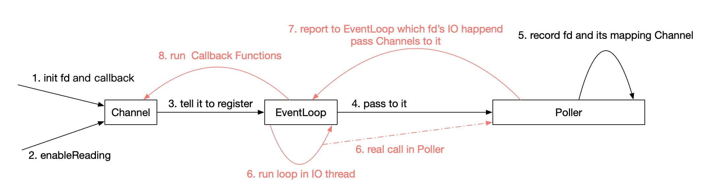
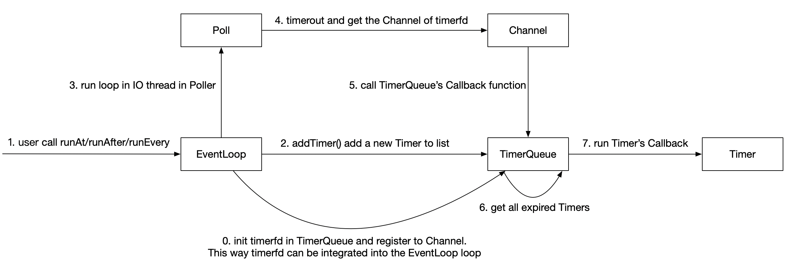
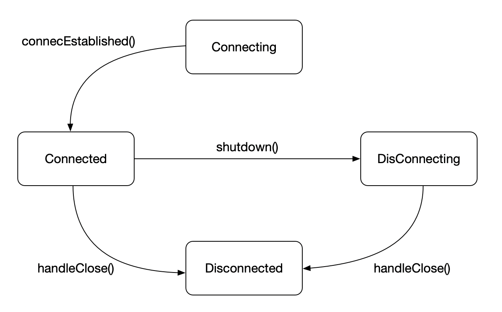

> 模仿 muduo 实现的一个 Reactor 网络库
> 记录一些关键的内容

## Reactor 核心

1. EventLoop 中有一个 ChannelList 和 Poller，每一个 Channel 和 Poller 都隶属于一个 EventLoop
2. 当有新的文件描述符上的事件需要监听的时候，只需要初始化 Channel、设置回调函数，然后调用 `Channel::enableReading` 即可
3. `enableReading` 函数会调用 Channel 所属的 EventLoop 的 `updateChannel()` 函数，该函数会在 Poller 中设置好 IO mutilplexing 的文件描述符结构体(struct pollfd)
4. 之后 EventLoop 执行 loop 循环的时候，会由 Poller 报告哪些文件描述符上的的 IO 事件发生了，并把这个 fd 对应的 Channel 报告给 EventLoop，EventLoop 会去执行 Channel 中的分发函数



## 定时器

支持三种功能：在某个延迟之后执行事件回调、在某一个未来的时间点执行事件回调、每隔一段时间执行事件回调

- Timer 类封装具体的延迟回调、延迟信息等内容
- TimerQueue 类存储在一个 timerfd 上注册的所有 Timer 回调，按照到期时间排序，并负责在超时的时候获取所有的超时 Timer 执行回调函数。每一个 TimerQueue 属于一个 EventLoop 对象

这里在实现的时候只借助一个 timerfd 文件描述符实现，并融入 EventLoop 事件循环。每次在超时并且执行完回调之后都会去 reset timerfd 的到期时间为 Timers 中最近的超时时间



在实际代码实现中，时间处理函数选择了现代 C++ 的 std::chrono，TimerQueue 中对 Timer 的管理选择了 std::unique_ptr。当然也因为使用 unique_ptr 收获了一些麻烦，具体包括

1. muduo 很多地方都适用 pImpl 惯用法，而 unique_ptr 在编译期要求在析构的时候必须能看到它管理对象的析构函数的定义
2. std::set 中的元素默认是 const 的，因为 set 采用红黑树实现，不能随意修改，一旦修改了就需要调整树的结构。所以在尝试从 std::set 移动对象到 std::vector 的时候产生了问题。我这里的解决方法比较暴力，直接在堆上创建一个新的 set entry 对象，这么做也是由于 set 中的对象反正马上就是要移除的（这里的错误场景是 getExpired() 尝试获取所有已经到期的 entry 移动到 vector 容器中返回）

## 多线程 Reactor 的完善

主要实现两个功能：

1. 支持在非 EventLoop 所属的线程中往 EventLoop 中添加回调函数。这里通过 eventfd 实现，其他线程往 eventfd 中写入 8 bytes 的数据，触发 eventfd 的 POLLIN 事件
2. 实现 EventLoopThread，以便可以在非主线程中执行事件循环

**第一个功能的实现上** 在 EventLoop 中添加了一个函数队列，用来保存通过写 eventfd 触发来告诉 IO 线程想要执行的回调函数。对外提供了 runInLoop() 接口，用来 "push" 回调函数

runInLoop() 的实现逻辑是，如果调用 runInLoop 的是 IO 线程自己，那么就直接执行函数，而如果调用的是别的线程，那么就放到函数队列中等待被执行

> queueInLoop() 函数用来添加新的回调函数，wakeup() 函数用来写 eventfd，handleRead() 函数用来读 eventfd

```c++
/// 将 Functor 插入队列中，并在必要时唤醒 IO 线程
/// 这个函数也可以被 IO 线程自己调用
void EventLoop::queueInLoop(const Functor &cb) {
  {
    std::lock_guard<std::mutex> lk(mutex_);
    pendingFunctors_.push_back(cb);
  }
  // 1. 如果调用 queueInLoop 的不是 IO 线程
  // 2. 如果此时正在执行 pending functor
  // 第二点的原因是，在 doPendingFunctors 中执行 functor 的时候也可能会调用 queueInLoop，
  // 此时如果不 wakeup，则在下一轮的 ::poll 中就不能及时得到有新的 functor 的事件信息，
  // 那么新的 functor 也就不能及时得到执行了
  if (!isInLoopThread() || callingPendingFunctors_)
    wakeup();
}
```

这类回调函数的执行时间点放到所有正常的事件执行完毕之后而不是放到 eventfd 文件描述可读的回调函数 handleRead() 中，这么做是有理由的：

1. 如果在 handleRead 中执行，那么在 IO 线程内注册了回调函数并且没有调用 EventLoop::wakeup() 的话，回调函数就不会被立即得到执行，必须等到 wakeup 被调用了之后才能执行
2. pending functor 的优先级低于其它事件
3. 如果放到 handleRead() 中，那么就必须调用 wakeup 才能得到执行，这样就需要涉及到三个系统调用 write-poll-read，但是在 IO 线程内注册回调函数的这种情况下其实用不着话费三个系统调用。放到 loop  中就可以在 IO 线程中注册回调的时候省略三个系统调用

书上还有一个关于 quit 的思考：为什么在 IO 线程调用 quit 就不必 wakeup()

```c++
void EventLoop::quit() {
  quit_ = true;
  // 1. 在 IO 线程调用 quit 就不需要 wakeup 了
  //    因为在 IO 线程中执行 quit 就说明此时线程正在执行事件回调函数，或者说必定不在 ::poll
  //    在完成事件回调函数之后会重新判断循环的 quit_
  // 2. 但是在别的线程就需要 wakeup
  //    因为此时 IO 线程可能睡眠在 ::poll 调用中，wakeup 之后可以唤醒 ::poll 中的睡眠
  //    其实就算没有 wakeup 也会超时唤醒
  if (!isInLoopThread())
    wakeup();
}
```

**第二个功能的实现上** 首先改进定时器的 addTimer，让其它线程可以注册超时回调函数。具体来说就是在 runInLoop() 中注册 addTimeInLoop() 函数，这样在 doPendingFunctors 的时候就会往 TimerQueue 中添加一个新的超时回调

第二点是 EventLoopThread，这个实现比较简单，就是启动一个线程执行 EventLoop，并在主线程中返回 loop 的指针，以便其他线程可以往其中添加事件回调

> 实现 addTimer 的时候遇到了一些问题，具体可以参考 daily 下面 2021-10-21 这一天关于 std::bind 的内容。这里简单说就是 std::bind 构造 std::functor 的时候对于 uncopyable 对象可能会有点问题

## 服务端连接建立过程

1. 创建 TcpServer 对象（EventLoop 对象也需要创建，这里不详述）
   - 在构造函数中会创建 Acceptor 对象
     - Acceptor 构造函数中会创建 server socket 文件描述符，并绑定地址
     - 还会 new 一个 Channel 用来对应 server socket fd，`Channel 的回调函数`是 `Acceptor::handleRead()`，该函数 accept 客户端连接并调用 Acceptor 中保存的“用户回调函数”
   - 构造函数体中设置 Acceptor 中的“用户回调函数” connectionCallback 为 TcpServer::newConnection
2. 用户调用 TcpServer 接口，设置自定义的回调函数（例如 readCallback, writeCallback, connectionCallback），这些函数会保存在 TcpServer 成员变量中
3. 用户调用 `TcpServer::start` 启动 TcpServer
   - 执行 `runInLoop` 将 Acceptor::listen 注册到 EventLoop 中，EventLoop 会及时执行该函数
     - `Acceptor::listen` 负责 server socket 的 listen 工作，然后将 Acceptor 中的 server socket Channel 注册到 EventLoop 中。这样 EventLoop 就可以观察到该 sockfd 上面的读写事件了
   - `EventLoop::loop` 下一轮事件循环会观察到 server socket 有新连接到来事件，然后执行 `Channel 的回调函数` `Acceptor::handleRead()` accept 客户连接
4. 执行 TcpServer::newConnection
   - new 一个 TcpConnection，里面保存着 client socket、服务端地址、客户端地址
     - TcpConnecion 构造函数中会为 client socket 创建 Channel，设置回调函数为 `TcpConnection::handleRead`
   - TcpConnection 中是用户传入回调函数的最终保存地点，这里会把 TcpServer 中的用户回调函数传给 TcpConnection
5. 调用 `TcpConnection::connectEstablished`
   - 把 client socket 的 Channel 注册到 EventLoop 中
   - 执行用户回调函数 `connectionCallback_`

## 服务端处理被动连接断开

new connection 到达创建 TcpConnection 的时候，将 TcpConnection::closeCallback_ 绑定到 `TcpServer::removeConnection`

1. EventLoop 监听 client socket 的可读事件，当客户端断开连接的时候会触发 POLLIN 事件
2. 回调 `TcpConnection::handleRead()` 函数，handleRead 函数读取到的字节数为 0，说明是客户端断开了连接
3. 调用 `TcpConnection::handleClose()` 函数
   - handleClose 负责关闭 client socket 的所有注册的事件，并执行 TcpConenction 中保存的 closeCallback_
4. 执行 `TcpServer::removeConnection`
   - 将 TcpConnection 的 shared_ptr 从 TcpServer 中移除
   - 往 EventLoop 中添加 pending functor, `TcpConnection::connectDestory`，*这里会延长 TcpConnection 的生命期，因为 std::bind 默认会拷贝传入的参数*
5. 执行 `TcpConnection::connecDestory`
   - 这里也会关闭一次 client socket 的所有注册事件，原因是有时候可以不必借助 handleClose 而直接调用 connectDestory
   - 执行用户的回调函数
   - 调用 EventLoop::removeChannel
6. 执行 `EventLoop::removeChannel`
   - 调用 Poller::removeChannel
7. 执行 `Poller::removeChannel`
   - 删除 client socket 相关的 Channel 和 struct pollfd

如果用户不持有 TcpConnection 的 shared_ptr，那么最后 TcpConnection 在 EventLoop::doPendingFunctors 函数结束，局部变量 functors 析构的时候，TcpConnection 也会随之析构

## 主动断开连接

`TcpConnection::shutdown()` 会断开 TcpConnection 管理的客户端的连接，该函数将 `TcpConnection::shutdownInLoop()` 作为 pending functor 添加到 EventLoop 中，等待 IO 线程执行

在断开连接的时候如果发现服务端正在等待 client socket 的 writable 事件，则会先等服务端完成数据的发送在断开连接



## 发送消息

1. 执行 `TcpConnection::send()`
   - 如果是 IO 线程那么接下来会调用 sendInLoop
   - 如果不是 IO 线程，则会将 TcpConnection::sendInLoop 作为 pending functor 添加到 IO 线程的 EventLoop 中
2. 执行 `TcpConnection::sendInLoop`
   - 检查当前 client socket 的应用层写缓冲是不是有待写的数据
     - 如果没有，则直接写文件描述符发送数据
   - 检查上一步是不是把数据发送完毕了或者发送了数据
     - 如果没有完全发送数据，则会把剩余的数据追加到 outputBuffer_ 中去，然后监听 client socket 的 writable 事件
3. 当数据没有完全发送完，并且 client socket writable 的时候，会触发 `Channel::handleWrite`
   - client socket 的 Channel::handleWrite 绑定到 TcpConnection::handleWrite
4. 执行 `TcpConnection::handleWrite`
   - 继续发送剩余的数据
     - 当数据发送关闭的时候检查当前是不是正在打算关闭 client socket，然后调用 `TcpConnection::shutdownInLoop()`
     - 如果数据没有发送完毕，则等待下一次的 writable

## 多线程 TcpServer

1. `TcpServer::setThreadNum()` 设置 EventLoopThreadPool 中的线程数量
2. `TcpServer::start()` 会执行 `EventLoopThreadPool::start()`
3. 执行 `EventLoopThreadPool::start(0)`
   - 创建多个 EventLoopThread，将所有的线程保存在 vector 中
   - 每个 EventLoopThread，调用 startLoop() 执行事件循环，返回的 EventLoop 保存在 vector 中。之后的 round-robin 会用到该 vector
4. 新连接到达的时候在 `TcpServer::newConnection()` 创建 TcpConnection 的时候会从线程池中选择一个线程，来管理该客户端连接的后续所有 IO 事件

断开连接的时候，由于 removeConnection 是在 TcpConnection 所在的线程被调用的，但是 TcpConnection 是被 TcpServer 管理的。所以需要先把 removeConnection 移到 server 执行，待 server 删除了该 TcpConnection 之后，由于 Channel 和 pollfd 都是在 TcpConnection 所在线程的 EventLoop 管理的，所以需要把最后的 connectDestory 移回对应的线程执行

## Epoll

Epoll 接口和 Poll 基本完全一样。需要注意的是，Epoll 中的 events_ 数组表示的是 epoll_wait 返回的可用文件描述符，所以 Channel::index 的意义就不再是 Poll 使用时候的，表示 pollfd 数组的索引了

这里 index 表示的是当前 Channel 的状态，分别有

- kNew. 新的 Channel，也可能是刚刚被 remove 的 Channel
- kAdded. 添加到 Epoll::channels_ 数组中，并且在 epollfd 中监听了 Channel 中的文件描述符
- kDeleted. 从 epoll 监听中移除了 Channel 中的文件描述符，但是还没有从 channels_ 数组中移除 Channel

